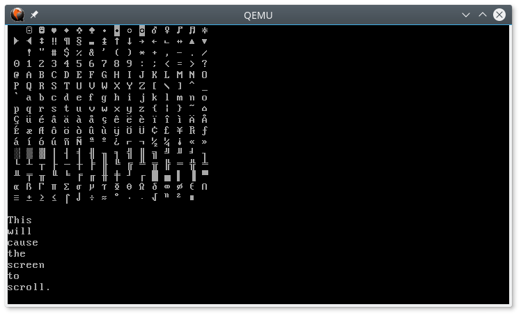

# Printing to the Screen

---

In both of the previous posts we printed some text to the screen. We've done so first in assembly code, then in Rust. However, there is a bit more to be discussed on the subject.

First of all, the method we are using may not always work. We can get it to work in Qemu and other virtual machines, and perhaps even your physical computer, but we are using antiquated technology that's disappearing. And we're going to continue to do so for this entire post. Why? Because it's easy to set up, and will give us some sort of output, so we can know what's going on.

When first starting out with a brand-new operating system, it's easy for things to go wrong, and we want some way to know what's happening. Once we have a few more things up and running, I hope to revisit this subject using more modern technology.

## Revisiting the Main Function

In our last post, we created a main function which printed "Welcome to Myros!" to the screen.

```rust
const CYAN: u8 = 0xb;
struct ColoredChar(u8, u8);

#[no_mangle]
extern "C" fn main() {
    let s = b"Welcome to Myros!";
    let video_mem = 0xb8000 as *mut ColoredChar;

    for (i, &c) in s.iter().enumerate() {
        unsafe {
            write_volatile(video_mem.add(i), ColoredChar(c, CYAN));
        }
    }
}
```

Let's look at some of the details of how this is done. First, you will notice that the video memory begins at the address `0xb8000`. This is true for the legacy 80x25 text mode which we are using. In other modes, the memory will be located in a different location. Second, you will notice that each character written to the screen involves writing one byte for the character and one byte for the color. That gives us only 256 possible characters, and 16 possible colors (4 bits for the foreground and 4 bits for the background).

That means that we can only support a tiny subset of the characters that can be represented by Rust's native `str`, which supports UTF-8. The default character set available is [Code page 437](https://en.wikipedia.org/wiki/Code_page_437), which is kind of like an extended ASCII character set, but with almost all of the control characters replaced with printable symbols.

Of course, if we're going to print much to the screen, we don't want to write out the code above every single time. We would like to be able to replace the code above with the following:

```rust
extern "C" fn main() {
	println!("Welcome to Myros!");
}
```

To that end, we will need to write a small text-mode VGA driver. Rather than putting the driver code, in **src/main.rs**, we want to include it as a module in a library crate. We will create **src/lib.rs** with the following content:

```rust
pub mod vga;
```

Then we create **src/vga.rs** to hold the driver.

## Glyphs and Colors

Before we get into actually writing to the screen, lets focus on the data we're going to write.

### Glyphs

As mentioned above, the legacy text mode only supports the characters from [code page 437](https://en.wikipedia.org/wiki/Code_page_437). Unlike ASCII, nearly every character in this set corresponds to a symbol that can be printed to the screen. The exceptions are the null character (index `0x00`), the space (index `0x20`) and the non-breaking space (index 0xff), each of which results in a single blank space. Thus, each character in this set, including null, space, and non-breaking space, takes up exactly one monospaced character cell on the screen. As such, we will call the type that represents these characters `Glyph`. Control characters, such as newline, carriage return, and tab are not `Glyph`s, and are not represented in this new type. We will handle them separately. Any other characters which don't have a corresponding `Glyph`, will be replaced with a replacement glyph, specifically `Glyph` number `0xfe` (`'■'`).

We define a `Glyph` as follows:

```rust
/// A glyph, corresponding to [Code page 437](https://en.wikipedia.org/wiki/Code_page_437) which can
/// be written to the screen.
#[derive(Debug, Copy, Clone, Eq, PartialEq, Ord, PartialOrd, Default)]
#[repr(transparent)]
pub struct Glyph(u8);

impl Glyph {
    /// A `Glyph` ('■') to replace `char`s which cannot be translated to a `Glyph`.
    pub const REPLACEMENT: Glyph = Glyph(0xfe);

    /// Returns the `Glyph` by index. This is not to be confused with the ASCII value. The index
    /// for each `Glyph` comes from [Code page 437](https://en.wikipedia.org/wiki/Code_page_437).
    pub const fn from_index(index: u8) -> Glyph {
        Self(index)
    }
}
```

`#[repr(transparent)]` ensures that the Glyph takes up the same amount of space as the underlying `u8`.It would not be good if some compiler optimizations decided to use more space than that.

We will also need to implement traits to allow conversions between `Glyph`s and `char`s. Specifically, we need to implement `From<Glyph>` for `char` and `TryFrom<char>` for `Glyph`.

Converting from a `Glyph` to a `char` can be simplified by adding the following array to our `Glyph` implementation.

```rust
impl Glyph {
    /// Table to translate `Glyph`s to `char`s.
    const CHARS: [char; 256] = [
        '\0','☺', '☻', '♥', '♦', '♣', '♠', '•', '◘', '○', '◙', '♂', '♀', '♪', '♫', '☼',
        '►', '◄', '↕', '‼', '¶', '§', '▬', '↨', '↑', '↓', '→', '←', '∟', '↔', '▲', '▼',
        ' ', '!', '"', '#', '$', '%', '&', '\'','(', ')', '*', '+', ',', '-', '.', '/',
        '0', '1', '2', '3', '4', '5', '6', '7', '8', '9', ':', ';', '<', '=', '>', '?',
        '@', 'A', 'B', 'C', 'D', 'E', 'F', 'G', 'H', 'I', 'J', 'K', 'L', 'M', 'N', 'O',
        'P', 'Q', 'R', 'S', 'T', 'U', 'V', 'W', 'X', 'Y', 'Z', '[', '\\',']', '^', '_',
        '`', 'a', 'b', 'c', 'd', 'e', 'f', 'g', 'h', 'i', 'j', 'k', 'l', 'm', 'n', 'o',
        'p', 'q', 'r', 's', 't', 'u', 'v', 'w', 'x', 'y', 'z', '{', '|', '}', '~', '⌂',
        'Ç', 'ü', 'é', 'â', 'ä', 'à', 'å', 'ç', 'ê', 'ë', 'è', 'ï', 'î', 'ì', 'Ä', 'Å',
        'É', 'æ', 'Æ', 'ô', 'ö', 'ò', 'û', 'ù', 'ÿ', 'Ö', 'Ü', '¢', '£', '¥', '₧', 'ƒ',
        'á', 'í', 'ó', 'ú', 'ñ', 'Ñ', 'ª', 'º', '¿', '⌐', '¬', '½', '¼', '¡', '«', '»',
        '░', '▒', '▓', '│', '┤', '╡', '╢', '╖', '╕', '╣', '║', '╗', '╝', '╜', '╛', '┐',
        '└', '┴', '┬', '├', '─', '┼', '╞', '╟', '╚', '╔', '╩', '╦', '╠', '═', '╬', '╧',
        '╨', '╤', '╥', '╙', '╘', '╒', '╓', '╫', '╪', '┘', '┌', '█', '▄', '▌', '▐', '▀',
        'α', 'ß', 'Γ', 'π', 'Σ', 'σ', 'µ', 'τ', 'Φ', 'Θ', 'Ω', 'δ', '∞', 'φ', 'ε', '∩',
        '≡', '±', '≥', '≤', '⌠', '⌡', '÷', '≈', '°', '∙', '·', '√', 'ⁿ', '²', '■', '\u{00a0}',
    ];
}
```

Then `From<Glyph>` looks like this:

```rust
impl From<Glyph> for char {
    /// Returns the `char` represented by the `Glyph`.
    fn from(glyph: Glyph) -> char {
        Glyph::CHARS[glyph.0 as usize]
    }
}
```

`TryFrom<char>`, on the other hand, is a little more complicated. The most obvious way to implement it might be to set up a hash from the array above with the `char` as the key and the `Glyph` as the value. However, Rust's standard collections, including hashes, aren't available from the `core` crate. Some of them are available in the `alloc` crate, which is available with `#![no_std]`. However, to use it, we would need some way to allocate memory on the heap, which we don't have (yet).

Another alternative, would be to use a sorted `static` array and a binary search. To produce the sorted array, we have two options. We can write out each element of the array in sorted order, as we did for `Glyph::CHARS`, or we fill and sort the array at run time, (since the sort functions are not `const`).
If we initialize the array at run time, we will need to synchronize access such that it is filled and sorted before it is used. In addition, we will want to avoid filling and sorting the array more than once. Rather than writing this synchronization code ourselves, we can use [`lazy_static`](https://docs.rs/lazy_static/), which does that work for us.

To use the `lazy_static` crate, we add the following to `Cargo.toml`.

```toml
[dependencies.lazy_static]
version = "1.4.0"
features = ["spin_no_std"]
```

The `spin_no_std` feature, as its name suggests, allows us to use it with `no_std`.

Now we can fill in the implementation details for `TryFrom<char>`.

```rust
use core::convert::TryFrom;
use lazy_static::lazy_static;

impl TryFrom<char> for Glyph {
    type Error = TryFromCharError;

    /// Returns the `Glyph` that represents a `char`, if one is available.
    fn try_from(c: char) -> Result<Self, Self::Error> {
        const SIZE: usize = (0x100-0x7f) + 0x20;
        lazy_static! {
            static ref GLYPHS: [(char, Glyph); SIZE] = {
                let mut arr = [('\0', Glyph(0)); SIZE];

                // fill the array using `Glyph::CHARS`. We skip the printable ascii characters
                // (0x20 - 0x7e) since they match up exactly with Code page 437.
                for (i, &c) in Glyph::CHARS[0x00..0x20].iter().enumerate() {
                    arr[i] = (c, Glyph(i as u8));
                }
                for (i, &c) in Glyph::CHARS[0x7f..0x100].iter().enumerate() {
                    let glyph = i as u8 + 0x7f;
                    arr[i + 0x20] = (c, Glyph(glyph));
                }

                arr.sort_unstable_by_key(|(c, _)| *c);

                arr
            };
        }

        // printable ascii characters (0x20 - 0x7e)
        if c >= ' ' && c <= '~' {
            return Ok(Glyph(c as u8));
        }

        if let Ok(i) = GLYPHS.binary_search_by_key(&c, |(c, _)| *c) {
            return Ok(GLYPHS[i].1);
        }

        Err(TryFromCharError)
    }
}
```

`lazy_static` executes the initialization code block the very first time `GLYPHS` is used. Subsequent reads do not run the initialization code.

While we do a binary search for most characters, we skip that for the ASCII characters (`0x20` through `0x7e`) where the character's integer value matches the corresponding `Glyph`'s integer value. Since those will be the most commonly used characters the binary search isn't necessary most of the time.

### Colors

As we saw earlier, printing to the screen involves not just the 1-byte `Glyph`, but we also need to send a byte for the color. The 16 colors available are as follows:

```rust
/// A color, which can be used for text and background colors.
#[allow(missing_docs)]
#[derive(Debug, Copy, Clone, Eq, PartialEq)]
#[repr(u8)]
pub enum Color {
    Black         = 0x0,
    Blue          = 0x1,
    Green         = 0x2,
    Cyan          = 0x3,
    Red           = 0x4,
    Magenta       = 0x5,
    Brown         = 0x6,
    LightGray     = 0x7,
    DarkGray      = 0x8,
    LightBlue     = 0x9,
    LightGreen    = 0xa,
    LightCyan     = 0xb,
    LightRed      = 0xc,
    LightMagenta  = 0xd,
    Yellow        = 0xe,
    White         = 0xf,
}
```

`#[repr(u8)]` tells the compiler we want it to be a 1-byte value, and `#[allow(missing_docs)]` tells the compiler not to warn that we didn't document each variant. I think the color names are self explanatory.

Of course, the byte we send to video memory needs to have both the foreground and background colors. For that we define the `Colors` struct.

```rust
/// The text and background colors to print a `Glyph`.
#[derive(Debug, Copy, Clone, Eq, PartialEq)]
#[repr(transparent)]
pub struct Colors(u8);
```

Like with `Glyph`, we use `#[repr(transparent)]` to ensure that it is always 1 byte. We implement `Colors` as follows:

```rust
impl Colors {
    /// Create new `Colors` with the default settings, `LightGray` on `Black`.
    pub const fn new() -> Colors {
        Colors::new_from(Color::LightGray, Color::Black)
    }

    /// Create new `Colors` from text and background colors.
    pub const fn new_from(text: Color, background: Color) -> Colors {
        Colors((background as u8) << 4 | text as u8)
    }

    /// Sets the text color.
    pub fn set_text_color(&mut self, color: Color) {
        self.0 = (self.0 & 0xf0) | color as u8;
    }

    /// Sets the background color.
    pub fn set_background_color(&mut self, color: Color) {
        self.0 = (self.0 & 0x0f) | (color as u8) << 4;
    }

    /// Returns the text color.
    pub fn text(self) -> Color {
        // SAFETY: this is sound because the value is limited to the range 0x0 to 0xf, and all
        // discriminants in this range are defined in `Color`.
        unsafe { core::mem::transmute(self.0 & 0xf) }
    }

    /// Returns the background color.
    pub fn background(self) -> Color {
        // SAFETY: this is sound because the value is limited to the range 0x0 to 0xf, and all
        // discriminants in this range are defined in `Color`.
        unsafe { core::mem::transmute(self.0 >> 4) }
    }
}
```

The background color gets stored in the upper 4 bits, and the text (or foreground) color in the lower 4 bits.

#### Unsafe Transmutations

You'll note the use of the `unsafe` function `transmute`. While Rust has a built-in conversion from an `enum` to the underlying integer type (assuming the `enum` has no fields), it does not have such a conversion to go the opposite direction. `transmute` takes data of one type and reinterprets the bytes and bits as another type. This can be [dangerous](https://doc.rust-lang.org/nomicon/transmutes.html) as it can lead to invalid values, values that the compiler may assume cannot happen when it's doing its optimizations. For an `enum` with no fields, that means that the underlying integer value **must** have the value of one of the discriminants. In this case, we know we are OK, as the bit shifts and bitwise _and_ operations ensure that we can only have the values `0x0` through `0xf`.

The page from **The Rustonomicon** linked above, says "This is really, truly, the most horribly unsafe thing you can do in Rust" and "you should deeply think about finding Another Way." However, we can be certain that our code is sound, so I don't see any issues with using it. However, if you want to avoid `transmute`, these functions could also be written using `match` statements.

I should also point out, that there is nothing inherently wrong with using `unsafe` code, as long as you have a good reason for it and can prove that your code is sound. And while in this case we could have used a `match` statement instead, when developing an operating system, `unsafe` simply can't be avoided much of the time. It's just a keyword that should let you know to think a little harder about what you're doing and how you're doing it. However, I would highly recommend referring to [**The Rustonomicon**](https://doc.rust-lang.org/nomicon/), and [**The Rust Reference**](https://doc.rust-lang.org/stable/reference/) often, when using `unsafe`, especially for `transmute`.

#### Default Colors

Moving on, you may also have noticed that the `new` method sets some default colors. That implies that it would probably be best to implement `Default` for `Colors`. However, we can't just derive it as we normally would, as that would give us a default value of zero, which is black text on a black background. Since that's clearly **not** the default we want, we will implement `Default` as follows, giving us the light gray text on a black background that's given by `new`:

```rust
impl Default for Colors {
    fn default() ->  Colors {
        Colors::new()
    }
}
```

### Colored Glyphs

To simplify writing to the screen, we add the `ColoredGlyph` struct. We don't make it public, as it will only be needed by internal code.

```rust
/// The combination of a `Glyph` and `Colors`.
#[derive(Debug, Copy, Clone, Eq, PartialEq, Default)]
#[repr(C)]
struct ColoredGlyph{
    glyph: Glyph,
    colors: Colors,
}

impl ColoredGlyph {
    const fn null(colors: Colors) -> ColoredGlyph {
        ColoredGlyph {
            glyph: Glyph(0),
            colors,
        }
    }
}
```

## Console Requirements and Design

Now that we have structures to represent the data let's focus on how we're going to write that data to the screen. The `core` crate provides a trait, [`core::fmt::Write`](https://doc.rust-lang.org/core/fmt/trait.Write.html), which allows us to use the [`write`](https://doc.rust-lang.org/core/macro.write.html) and [`writeln`](https://doc.rust-lang.org/core/macro.writeln.html) macros. It is similar to `std::io::Write` in the standard library. It doesn't give us `println` yet, but it's a step in that direction.

We will want to create a struct called `Console`, and have it implement `Write`. The `Write` trait requires a method called `write_str`, which, as its name implies, will write a string to the screen. We could just copy much of the code from `main` into `write_str`, but that code lacks much of the functionality we need. Here are some of the requirements for the `Console`.
- It must remember where it left off writing and continue from the same place.
- If writing would pass the end of a line, it must continue at the beginning of the next line.
- If writing would pass the bottom of the screen, all lines must be moved up one line, removing the top line and clearing the bottom line. Writing would then continue at the beginning of the bottom line.
- Except for a few special control characters, the characters in the string need to be converted to `Glyph`s before being written.
  - When a newline (`'\n'`) is encountered, the rest of the line should be left blank and writing should continue from the beginning of the next line.
  - The carriage return (`'\r'`) should be ignored (allowing for CRLF).
  - When a tab (`'\t'`) is encountered, writing must continue at the next tab stop, leaving all space in-between blank.
  - Any unused control characters or other characters which cannot be converted to `Glyph`s should be replaced with `Glyph::REPLACEMENT`.
- It must update the cursor position after each write.
- It must be able to synchronize writes and other changes between processes or threads (once those are implemented).

That last requirement means that we need to hide all the data behind a `static` mutex. However, we can't use the mutexes provided in `std`. An alternative which can be used with `no_std` is in the [`spin`](https://mvdnes.github.io/rust-docs/spin-rs/spin/index.html) crate, which provides synchronization using spin locks. We will hide the console's data behind a `static` [`spin::Mutex`](https://mvdnes.github.io/rust-docs/spin-rs/spin/struct.Mutex.html). We will provide a public function, `console`, to return a `Console` object, which will just contain a reference to the `Mutex` containing the console data.

To allow for scrolling, the `Console` will have access, through the `Mutex`, to a circular buffer which can be written to the screen. We could implement scrolling without the buffer, but that would require reading from video memory, which is very slow. We will flush the buffer to video memory after each line and at the end of every write.

Finally, we will need a new type to represent the position on the screen.

Here are our various type declarations, plus some necessary constants.

```rust
use spin::Mutex;

/// A struct to represent the VGA console.
#[derive(Debug, Clone)]
pub struct Console(&'static Mutex<ConsoleData>);

impl Console {
    /// The number of `Glyphs` that can be displayed in one line on the screen.
    pub const WIDTH: usize = 80;
    /// The number of lines on the screen.
    pub const HEIGHT: usize = 25;
    /// The number of lines in the buffer.
    pub const BUFFER_LINES: usize = Self::HEIGHT * 2;
    /// The number of `Glyphs` that will fit between tab stops.
    pub const TAB_WIDTH: usize = 8;
}

/// The data for a `Console`.
#[derive(Debug)]
struct ConsoleData {
    video_mem: *mut [ColoredGlyph; Console::WIDTH],
    buffer: [[ColoredGlyph; Console::WIDTH]; Console::BUFFER_LINES],
    colors: Colors,
    loc: Location,
}

/// A location on the screen.
#[derive(Debug, Copy, Clone, Eq, PartialEq, Ord, PartialOrd, Default)]
pub struct Location(usize);
```

## The Location

As seen above, we represent the location as a single `usize`. We use the modulo and division operators to give us the line and column.

```rust
impl Location {
    /// Returns the location of the first character of the first line.
    pub const fn new() -> Location {
        Self(0)
    }

    /// Returns the horizontal offset from the left-most column of the screen.
    pub fn col(self) -> usize {
        (self.0 % Console::WIDTH) as usize
    }
    
    /// Returns the total number of lines printed.
    pub fn line(self) -> usize {
        (self.0 / Console::WIDTH) as usize
    }
}
```

You'll note that the `line` method returns the total number of lines printed, not the current line on the screen or in the buffer. The line of the buffer will always be `location.lines() % Console::BUFFER_LINES`. The line on the screen will be either `location.lines()` or `Console::HEIGHT - 1`, whichever is less.

We will also need methods to find the next tab stop and the beginning of the next line.

```rust
    /// Returns the `Location` of the next tab stop.
    pub fn next_tab(self) -> Location {
        Self((self.0 - self.0 % Console::TAB_WIDTH) + Console::TAB_WIDTH)
    }

    /// Returns the `Location` of the beginning of the next line.
    pub fn next_line(self) -> Location {
        Self((self.0 - self.0 % Console::WIDTH) + Console::WIDTH)
    }
}
```

Finally, we want to implement the addition operators (`+` and `+=`) for `Location`. We don't implement the subtraction operators, as we will just be moving forward as we write to the screen.

```rust
use core::ops;

impl ops::Add<usize> for Location {
    type Output = Self;

    fn add(self, n: usize) -> Self {
        Self(self.0 + n)
    }
}

impl ops::AddAssign<usize> for Location {
    fn add_assign(&mut self, n: usize) {
        self.0 += n;
    }
}
```

## Writing to the Screen

Now we have what we need to implement `Console::write_str`. However, it will simply unlock our `ConsoleData` and call `ConsoleData::write_str`.

```rust
impl Write for Console {
    /// Writes a string to the `Console`.
    ///
    /// The following characters are given special treatment.
    ///
    /// - The newline (`'\n'`) advances to the beginning of the next line.
    /// - The carriage return (`'\r'`) is ignored.
    /// - The tab (`'\t'`) advances to the next tab stop.
    ///
    /// All other characters in the string are first converted to `Glyph`s, then written to the
    /// screen. Any characters that cannot be converted are replaced with `Glyph::REPLACEMENT`.
    fn write_str(&mut self, s: &str) -> fmt::Result {
        self.0.lock().write_str(s);

        Ok(())
    }
}
```

Then, `ConsoleData::write_str` will look like this:

```rust
impl ConsoleData {
    fn write_str(&mut self, s: &str) {
        let mut new_loc = self.loc;

        for c in s.chars() {
            new_loc = match c {
                '\n' => { new_loc.next_line() },
                '\t' => { new_loc.next_tab() },
                '\r' => { new_loc },
                _ => {
                    // write the glyph
                    let buf_line = new_loc.line() % Console::BUFFER_LINES;
                    self.buffer[buf_line][new_loc.col()] = ColoredGlyph {
                        glyph: Glyph::try_from(c).unwrap_or(Glyph::REPLACEMENT),
                        colors: self.colors,
                    };

                    new_loc + 1
                },
            };

            if new_loc.line() > self.loc.line() {
                self.buffer[new_loc.line() % Console::BUFFER_LINES]
                    = [ColoredGlyph::null(self.colors); Console::WIDTH];
                self.scroll_and_flush(new_loc);
            }
        }
        self.flush(new_loc);
    }
}
```

As you can see, it doesn't write directly to video memory, but writes to the buffer instead. Once we reach the next line, we call `self.scroll_and_flush`, which copies the last `Console::HEIGHT` lines of the buffer to the screen. Once the write is completed, we call `self.flush`, which writes just the last line to the screen. Here are those methods:

```rust
impl ConsoleData {
    fn scroll_and_flush(&mut self, new_loc: Location) {
        let top_line = (new_loc.line() + 1).saturating_sub(Console::HEIGHT);

        for (scr_line, line) in (top_line..).take(Console::HEIGHT).enumerate() {
            let buf_line = line % Console::BUFFER_LINES;

            unsafe {
                // SAFETY: sound because `self.video_mem` should always point to a location of
                // Console::HEIGHT lines that we have access to, and `scr_line` is always less than
                // `Console::HEIGHT`. Also, access to `ConsoleData`, which is private, is synchronized
                // using a Mutex, which prevents data races.
                self.video_mem.add(scr_line).write_volatile(self.buffer[buf_line]);
            }
        }

        self.loc = new_loc;
    }

    fn flush(&mut self, new_loc: Location) {
        let scr_line = core::cmp::min(new_loc.line(), Console::HEIGHT - 1);
        let buf_line = new_loc.line() % Console::BUFFER_LINES;

        unsafe {
            // SAFETY: sound because `self.video_mem` should always point to a location of
            // Console::HEIGHT lines that we have access to, and `scr_line` is always less than
            // `Console::HEIGHT`. Also, access to `ConsoleData`, which is private, is synchronized
            // using a Mutex, which prevents data races.
            self.video_mem.add(scr_line).write_volatile(self.buffer[buf_line]);
        }

        self.loc = new_loc;
    }
}
```

To do the work of copying to video memory we use the [`write_volatile`](https://doc.rust-lang.org/std/primitive.pointer.html#method.write_volatile) pointer method. It guarantees that the write won't be optimized away. Without doing a volatile write, the compiler could assume that this data is written, but never read, and optimize the write away. However, `write_volatile` guarantees that the write will "not be elided or reordered by the compiler across other volatile operations."

### Accessing the Console

Currently, there is no way for outside code to construct or gain access to a `Console` object. We alleviate that by adding the `console` function below, which also creates the `static` `Mutex` containing `ConsoleData`. Because we can construct a `Mutex<ConsoleData>` using only `const` functions, `lazy_static` isn't necessary. However, there is still some one-time initialization we want to do, specifically clearing the screen. Because the buffer is initially empty, calling `scroll_and_flush` will clear the screen. However, we need a way to ensure that it is only called the first time that `console` is called. We do that using [`spin::Once`](https://mvdnes.github.io/rust-docs/spin-rs/spin/struct.Once.html).

```rust
/// Returns a handle to the VGA `Console`. Writes to the `Console` are synchronized and are thus
/// thread safe.
pub fn console() -> Console {
    const VIDEO_MEM_ADDR: u64 = 0xb8000;
    static CONSOLE: Mutex<ConsoleData> = Mutex::new(ConsoleData {
        video_mem: VIDEO_MEM_ADDR as *mut [ColoredGlyph; Console::WIDTH],
        buffer: [[ColoredGlyph::null(Colors::new()); Console::WIDTH]; Console::BUFFER_LINES],
        colors: Colors::new(),
        loc: Location::new(),
    });

    static INIT: spin::Once<()> = spin::Once::new();
    INIT.call_once(|| {
        // clear the screen
        CONSOLE.lock().scroll_and_flush(Location::default());
    });

    Console(&CONSOLE)
}
```

Trying to compile this, however, results in an error.

```
error[E0277]: `*mut [vga::ColoredGlyph; 80]` cannot be sent between threads safely
   --> src/vga.rs:139:5
    |
139 | /     static CONSOLE: Mutex<ConsoleData> = Mutex::new(ConsoleData {
140 | |         video_mem: VIDEO_MEM_ADDR as *mut [ColoredGlyph; Console::WIDTH],
141 | |         buffer: [[ColoredGlyph::null(Colors::new()); Console::WIDTH]; Console::BUFFER_LINES],
142 | |         colors: Colors::new(),
143 | |         loc: Location::new(),
144 | |     });
    | |_______^ `*mut [vga::ColoredGlyph; 80]` cannot be sent between threads safely
    |
    = help: within `vga::ConsoleData`, the trait `core::marker::Send` is not implemented for `*mut [vga::ColoredGlyph; 80]`
    = note: required because it appears within the type `vga::ConsoleData`
    = note: required because of the requirements on the impl of `core::marker::Sync` for `spin::Mutex<vga::ConsoleData>`
    = note: shared static variables must have a type that implements `Sync`
```

Since pointers don't implement `Send` (or `Sync`), `ConsoleData` can't inherit `Send`, which means `Mutex<ConsoleData>` doesn't implement `Sync` and cannot be used in a shared `static` variable.

The solution is simple; we implement `Send` for `ConsoleData`. However, `Send` is an unsafe trait, so we need to ensure that implementing it is sound. Specifically, we need to ensure that there are no data races, which we do by only creating one instance and controlling access to it with a `Mutex`.

```rust
// SAFETY: sound because only one instance of `ConsoleData` is ever created, and its pointer
// `video_mem` is never accessed outside of `ConsoleData`. Also, access to the only instance of
// `ConsoleData` is synchronized using a `Mutex`.
unsafe impl Send for ConsoleData { }
```

Now that we can finally access the `Console` from outside the `vga` module, let's try it out in our `main` function.

```rust
use core::fmt::Write;
use myros::vga::console;

#[no_mangle]
extern "C" fn main() {
    writeln!(console(), "Welcome to Myros!");
}
```

Running the code above, we should see the message on the screen in light-gray text with a black background.

### The `print` and `println` Macros

We're quite close to our goal of using the `print` and `println` macros. There's just one problem. Those macros aren't defined in the `core` crate, and even if they were, they wouldn't work with our `Console` type. Let's have a look at how these macros are implemented in `std`.

Visiting the documentation for the [`print`](https://doc.rust-lang.org/std/macro.print.html) macro, and clicking the "src" link, we see the following:

```rust
macro_rules! print {
    ($($arg:tt)*) => ($crate::io::_print($crate::format_args!($($arg)*)));
}
```

We see that it calls a macro called `std::format_args`, which is also [available in `core`](https://doc.rust-lang.org/core/macro.format_args.html), and passes the result of that to `std::io::_print`, which we won't find documentation for at all.

However, doing some digging in the source code, we find, that the end result of calling `_print` is a call to `stdout()::write_fmt(args)` where `args` is the output of the `format_args` macro above. And, as it turns out, because we implemented `Write` for `Console`, it also has a `write_fmt` method. So we will create our own `_print` function in **src/vga.rs**, with the documentation hidden, as follows.

```rust
/// Helper function for the `print!` macro.
#[doc(hidden)]
pub fn _print(args: fmt::Arguments) {
    console().write_fmt(args).expect("INFALLIBLE");
}
```

Then we can implement the `print` macro nearly identically to the version in `std`.

```rust
/// Prints to the screen.
///
/// The following characters are given special treatment.
///
/// - The newline (`'\n'`) moves the cursor to the beginning of the next line.
/// - The carriage return (`'\r'`) moves the cursor to the beginning of the current line.
/// - The tab (`'\t'`) moves the cursor to the next tab stop.
///
/// All other characters in the string are first converted to `Glyph`s, then written to the
/// screen. Any characters that cannot be converted are replaced with `Glyph::REPLACEMENT`.
#[macro_export]
macro_rules! print {
    ($($arg:tt)*) => ($crate::vga::_print(core::format_args!($($arg)*)));
}
```

Now, looking at the code for [`std::println`](https://doc.rust-lang.org/std/macro.println.html), we see the following.

```rust
macro_rules! println {
    () => ($crate::print!("\n"));
    ($($arg:tt)*) => ({
        $crate::io::_print($crate::format_args_nl!($($arg)*));
    })
}
```

It uses a macro, `format_args_nl` which is unstable because "`format_args_nl` is only for internal language use and is subject to change." Of course, the only difference between `format_args_nl` and `format_args` is that `format_args_nl` adds a newline to the end. There's no reason to use an unstable feature for something as simple as that.

If we look at [`fmt::Arguments`](https://doc.rust-lang.org/core/fmt/struct.Arguments.html), the type that `format_args` returns, we see that it implements `Display`. That makes things easy. We can just have `println` call `print`, passing it the result of `format_args`, like so:

```rust
/// Prints to the screen, with a newline. Otherwise the same as [`print`](macro.print.html).
#[macro_export]
macro_rules! println {
    () => ($crate::print!("\n"));
    ($($arg:tt)+) => ({
        $crate::print!("{}\n", core::format_args!($($arg)+));
    })
}
```

Now, let's replace `main` with the following.

```rust
use myros::{print, println};

#[no_mangle]
extern "C" fn main() {
    println!("Welcome to Myros!");
}
```

That should give us the same result as using `writeln` did, but without having to specify the console.

Now let's verify that all our glyphs print correctly and that scrolling works properly.

```rust
use myros::{vga, print, println};

#[no_mangle]
extern "C" fn main() {
    println!("Welcome to Myros!");

    println!();
    for i in 0..=255 {
        print!(" {}", char::from(vga::Glyph::from_index(i)));
        if i % 16 == 15 {
            println!();
        }
    }
    println!();
    
    println!("This");
    println!("will");
    println!("cause");
    println!("the");
    println!("screen");
    println!("to");
    println!("scroll.");
}
```

The result should look like the following with "Welcome to Myros!" and the blank line following it scrolled off the top of the screen.



### Panic Messages

You may recall from the "Hello, world!" post that we created a panic handler, but that it doesn't display a message. Now that we have `print` and `println` working, let's change that. The [`PanicInfo`](https://doc.rust-lang.org/core/panic/struct.PanicInfo.html) structure that it takes as an argument implements `Display`, so all we need to do is call `print` on it, and it will print a message similar to what you're accustomed to. We add the word "kernel" to the front so the user knows that it's the kernel that panicked, and not a user process.

```rust
/// Replaces the panic handler from the standard library which is not available
/// when using `#![no_std]` in a binary.
///
/// Does not return.
#[panic_handler]
pub fn panic(info: &PanicInfo) -> ! {
    print("kernel {}", _info);
    halt();
}
```

To test it, let's add a call to panic in our `main` function.

```rust
#[no_mangle]
extern "C" fn main() {
    println!("Welcome to Myros!");
    
    println!();
    for i in 0..=255 {
        print!(" {}", char::from(vga::Glyph::from_index(i)));
        if i % 16 == 15 {
            println!();
        }
    }
    println!();
    
    panic!();
}
```

This results is a message like the following:

```
kernel panicked at 'explicit panic', src/main.rs:38:5
```

To get a more meaningful message, we could, of course, add a format string to the `panic` call, the same as we could in any other Rust program.

## The Halting Problem
Unfortunately, this code  will currently triple fault if built in release mode. This is due to a [bug](https://github.com/rust-lang/rust/issues/28728) in the Rust compiler. Specifically, the bug is in how Rust handles the loop in the `halt` function which we wrote in the first post.

```rust
pub fn halt() -> ! {
    loop {}
}
```

A triple fault is when a CPU exception causes a second exception (double fault), which then causes a third exception, at which point the CPU gives up and resets itself. Note though that nothing in the `halt` function should cause an exception of any kind. It is a divergent fuction (one that should never return), which contains an infinite loop. The infinite loop **should** ensure that the end of the function is never reached. The problem arises because LLVM, a toolchain used by Rust, optimizes out loops which have no side effects, even if they are infinite. As a result, the loop in the `halt` function is elided, so execution immediately reaches the end of the function, a point which is supposed to be unreachable.

Rust (in the current implementation) places a `ud2` instruction at the end of the function to generate an exception if it is ever reached. This ensures that if execution does reach the end of the function, that it doesn't end up executing whatever code comes after the function (which would be a security flaw). Since we haven't yet defined any exception handlers, it double faults because it can't find an exception handler, then triple faults because it can't find a double-fault handler. 

We can work around this bug by adding volatile code or side effects within the infinite loop. As it turns out, we want to do that anyway. The loop as written would keep the CPU quite busy doing nothing. When the CPU is doing nothing, it's best to halt the CPU with the `hlt` instruction, as we did in **boot.asm**. The `hlt` instruction halts the CPU until the next interrupt. Our code began with interrupts disabled, but at some point we will turn them on. Since we won't be executing any more code once the `halt` function is called, let's also make sure interrupts are turned off using the `cli` instruction.

Of course, to use these instructions in Rust code, we need a way to write inline assembly. The version of [inline assembly](https://doc.rust-lang.org/beta/unstable-book/library-features/asm.html) we will be using was just [released](https://blog.rust-lang.org/inside-rust/2020/06/08/new-inline-asm.html) this year (2020). There is an older syntax, which is still available for the time being, but will eventually dissapear. Both versions are unstable features.

Adding these two instructions, our `halt` function now looks like this:

```rust
#![feature(asm)]

pub fn halt() -> ! {
    loop {
        // SAFETY: this is sound as no memory is accessed and no other code is even exectuded
        // following this loop.
        unsafe {
            asm!(
                "cli",
                "hlt",
                options(nomem, nostack)
            );
        }
    }
}
```

## Printing in Color
We could add some additional functionality to change the text and background colors. However, since the output is primarily meant for debugging purposes at this point, I won't bother with that right now. However, this post should provide you with all the information needed to be able to do so on your own, if you wish. If you do choose to implement this functionality, you may want to make use of the [ANSI escape sequences](https://en.wikipedia.org/wiki/ANSI_escape_code) for changing colors. These could allow you to put the color changes directly in the calls to `print` along with the text that you are printing.
